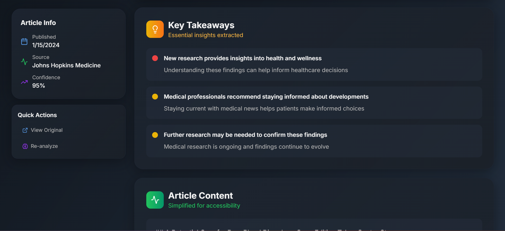

# AI-Based Health News Curator

An intelligent health news summarization platform that transforms complex medical articles into digestible, user-friendly content using advanced AI.

## Demo Video

- [Watch the Demo Video](https://www.loom.com/share/e42a7174ffe34cb682788ac0a6b1332c?sid=2d0718e3-1085-4b60-ae81-a6c3a933df3f)

## Screenshots

Here are some screenshots from the application:

<p align="center">
  
</p>

<p align="center">
  
</p>

<p align="center">
  
</p>

<p align="center">
  
</p>

<p align="center">
  
</p>

<p align="center">
  
</p>

<p align="center">
  
</p>

## 1. Project Setup & Demo

**Web Application Setup:**
```sh
# Install dependencies
npm install

# Start development server
npm run dev / npm start
```


**Quick Start:**
1. Clone the repository
2. Run `npm install && npm run dev / npm install && npm start`
3. Navigate to http://localhost:8080
4. Click "Process Health Articles" to see the AI in action

## 2. Problem Understanding

**Core Challenge:** Transform complex health news articles into accessible, digestible content for general audiences.

**Our Solution:** 
- Load health articles from mock data and an option to use RSS feeds
- AI processes each article into 2-line TL;DR summaries
- Extract 3 key takeaways with importance levels
- Rewrite content in simpler, patient-friendly language
- Present in a professional, medical-grade interface

**Assumptions Made:**
- Users need quick medical insights without jargon
- Professional healthcare workers require detailed analysis
- Content should be both accessible and medically accurate

## 3. AI Prompts & Iterations

**Initial Prompt Strategy:**
```
"Summarize this health article in 2 lines focusing on main findings and patient impact"
```

**Issues Faced:**
- Inconsistent summary lengths
- Too much medical jargon
- Missing clinical relevance scoring

**Refined Prompts:**
```
"As a medical news expert, create a concise 2-line summary of this health article.
Requirements:
- Exactly 2 sentences
- First line: Main finding or development  
- Second line: Why it matters or impact
- Use simple, clear language
- Avoid medical jargon
- Keep each line under 80 characters"
```

**Takeaway Extraction:**
```
"Extract 3 key takeaways from this medical article. For each:
- Classify importance: high/medium/low
- Provide explanation in patient-friendly terms
- Focus on actionable insights"
```

## 4. Architecture & Code Structure

**Navigation Management:**
- `App.tsx` - Main application router with screen state management
- Context-based navigation between 4 core screens

**Screen Components:**
- `NewsLoader.tsx` - Screen 1: Article loading interface
- `ProcessingHub.tsx` - Screen 2: AI processing with real-time progress
- `CuratedFeed.tsx` - Screen 3: Paginated feed with pull-to-refresh
- `ArticleExpanded.tsx` - Screen 4: Detailed view with simplified content

**AI Integration:**
- `aiService.ts` - Handles all Groq AI API calls
- Supports demo mode with fallback data
- Error handling and retry logic
- Content simplification algorithms

**State Management:**
- `NewsContext.tsx` - React Context with useReducer
- Global state for articles, processing status, navigation
- Type-safe action dispatching
- Persistent state across screens

**UI Architecture:**
- Professional medical design system
- Responsive 12-column grid layout
- Lottie animations for enhanced UX
- shadcn/ui + Tailwind CSS for consistency

## 5. Screenshots / Screen Recording

### Screen Flow:
1. **Loading Interface** - Professional welcome screen with doctor animation
2. **AI Processing** - Real-time progress with heart animation and pipeline visualization  
3. **Curated Feed** - Clean article list with AI summaries and statistics
4. **Article Details** - Expanded view with takeaways and simplified content

*Note: Screenshots showcase professional medical-grade UI with consistent branding*

## 6. Known Issues / Improvements

**Current Limitations:**
- Limited to Groq AI model (could expand to multiple providers)
- No user personalization or preference settings
- Basic pagination (could implement infinite scroll)

**Planned Improvements:**
- **Multi-Language Support:** Translate content for global accessibility
- **User Profiles:** Personalized content recommendations
- **Offline Mode:** Cache processed articles for offline reading
- **Advanced Analytics:** Track reading patterns and engagement
- **Medical Professional Tools:** Enhanced features for healthcare workers

## 7. Bonus Work

**Enhanced Polish & Features:**

**Professional UI/UX:**
- Medical-grade design system with consistent branding
- Lottie animations (Doctor, Heart loading animations)
- Glass morphism effects and professional gradients
- Responsive design optimized for all devices

**Advanced Features:**
- Real-time processing progress with animated pipeline
- Live RSS feed
- Sticky sidebars for enhanced navigation
- Quick actions (View Original, Re-analyze articles)
- Professional statistics and confidence scoring
- Error boundaries and graceful failure handling

**Technical Excellence:**
- TypeScript for type safety
- Modular component architecture  
- Optimized performance with proper state management
- Professional code organization and documentation
- Comprehensive error handling

## Technologies Used

- **React 18** + **TypeScript** - Modern web development
- **Vite** - Lightning-fast build tool
- **shadcn/ui** - Professional component library
- **Tailwind CSS** - Utility-first styling
- **Groq SDK** - Advanced AI integration
- **Lottie** - Professional animations
- **React Context** - State management
#
